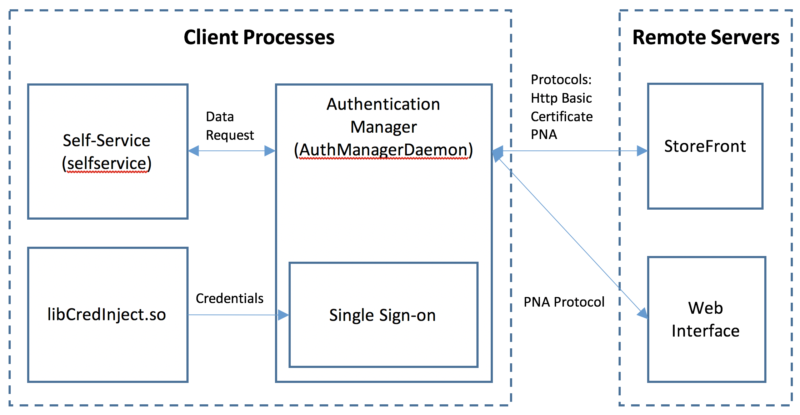
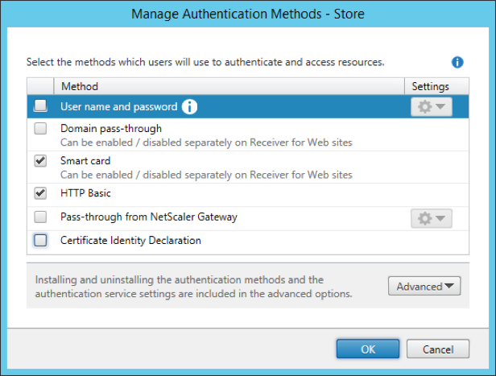

# Authentication Manager Configuration for Fast Connect Use Cases [Citrix Workspace app for Linux]

This document describes the configuration required for the Authentication Manager (AM) component of Citrix Workspace app for Linux to support Fast Connect (FC) use cases.

The FC use cases use APIs for Citrix Workspace app for Linux in a scripted fashion to change the current user by modifying the credential in the SSO component (within AM). 
AM authenticates on behalf of the Self-Service Plug-in (SSP) using Single Sign-on (SSO) protocols, where the user credentials are provided through the SSO component.

Normally AM assumes a single unchanging user tied to the client desktop session, but this is not true for the FC use cases as there are multiple users. To allow the FC use cases to function correctly, some specific AM functionalities need to be enabled and other behaviours that conflict with FC need to be disabled.

Configuration for AM is done with AM’s configuration file. The appendix contains a quick configuration settings list giving entry keys for configuring the normal FC use cases.

## Component overview

The SSO component of Citrix Workspace app for Linux acts as a secure cache for credentials used for Single Sign-on. The FC API (libCredInject.so) stores either a username and password or a smart card PIN credential in SSO when a user is changed.

The Self-Service Plugin (SSP) performs tasks with StoreFront or a Web Interface/PNA server such as enumerating a user’s applications and requesting ICA files for a launch.

Authentication Manager is used by SSP to automatically authenticate requests to StoreFront or the Web Interface. AM uses the credentials securely stored in SSO to authenticate with StoreFront or the Web Interface.

NetScaler Gateway is not currently supported for Fast Connect use cases.



## Fast Connect authentication types

Fast Connect use cases may vary because they are defined by partners using Citrix APIs. As far as the AM component’s functionality is concerned, it falls into three categories based on the type of authentication protocol being used. The credential types used and the protocols are:

* Username, domain and password with the HTTP Basic protocol
* PIN and smart card with the client certificate protocol
* Username, domain and password with the PNA protocol

If StoreFront is being used, it needs to be configured through the StoreFront console to offer the relevant protocols to the client. Enable the required protocol from the StoreFront console:



Note that other protocols can also be enabled in StoreFront without any negative effect. On the client AM is configured to use only the authentication methods required for the FC use case.

## Username, domain and password – HTTP Basic

When AM needs to authenticate and it detects that there is a username-password credential present in SSO, it uses the HTTP Basic authentication protocol to authenticate to StoreFront. This protocol is described in RFC 2617.

The HTTP Basic protocol is a good fit for FC use because it allows SSO from the saved credentials and does not show an authentication user interface. The HTTP Basic protocol does not support capabilities such as password expiry warnings or password changes.

Note that the “HTTP” part of the name “HTTP Basic” does not imply HTTP URLs are used. The HTTP Basic protocol sends the password in plain text. As a result, AM will refuse to use this protocol with anything other than an encrypted HTTPS connection.

## Smart card – Client certificate

When AM needs to authenticate and detects that there is a smart card PIN credential present in SSO, it uses client certificate authentication with an HTTPS connection to authenticate to StoreFront.

## Username, domain and password – PNA Protocol

If your clients use a Web Interface site or the StoreFront legacy PNA service, AM uses the PNA protocol to make resource requests. AM will do SSO for the PNA Protocol using the username, domain and password from SSO.

## Authentication Manager configuration file path

The AM configuration file is found at:

`$ICAROOT/config/AuthManConfig.xml`

where the value of ICAROOT depends on the deployment.

The default path is:

`/opt/Citrix/ICAClient/config/AuthManConfig.xml`

The configuration file is a plain XML file that you can edit with any text editor.

## Configuring the authentication protocols

Most FC deployments are expected to use one SSO authentication protocol. By default, AM has a number of authentication protocols enabled. These non-SSO protocols can conflict with FC use cases and should be disabled to prevent unwanted authentication behaviour. For example, integrated Windows authentication to StoreFront always authenticates to StoreFront with the authenticated user of the current session and not the desired FC user.

The ProtocolOrder is a multi-string key value that controls the order in which the StoreFront protocols attempt to authenticate to StoreFront. Protocols not listed in this key are implicitly disabled and not used to log onto StoreFront. AM attempts to use the protocols in the order they are listed in the key value. Note that these protocol name values match the protocol names that StoreFront offers the client to authenticate with. There is no PNA SSO protocol as such because it is a legacy protocol.

Multiple string values must be entered in the configuration file as a list of comma-separated strings with no extra spaces.

The ProtocolOrder is not present in the configuration file by default but it has a default value as follows:

* **HttpBasic**
* IntegratedWindows
* CitrixAGBasic
* CitrixAGBasicNoPassword
* **Certificate**
* CustomForms
* FormsVariant
* ExplicitForms

The values are case insensitive. Only the bold protocol names are needed for FC.
Set the string values to contain the protocols the client is supposed to use.

For username and password credentials, set it to:

* **HttpBasic**

For smart card use cases, set it to:

* **Certificate**

If your client supports both types of credentials:

* **HttpBasic**
* **Certificate**

If the client uses only the PNA protocol, all StoreFront protocols should be disabled. Set the ProtocolOrder value to:

* **None**

## Configuring HTTPBasic authentication

The HTTPBasic protocol performs a username, domain and password logon to StoreFront with the credentials stored in SSO.

By default, the HTTPBasic protocol is explicitly disabled even if it is specified in the ProtocolOrder key value. To enable it, set the following key value to true under the Protocols node:

```
<Protocols>
	<HTTPBasic>
		<Enabled>True</Enabled>
	</HTTPBasic>
</Protocols>
```

The default configuration file contains an example specific for this case, uncomment it to enable HTTPBasic.

## Configuring smart card authentication

This section covers only the configuration affecting FC. It does not cover configuring your domain’s and the client’s public key infrastructure for smart cards, which should be configured before you attempt to set up FC.

The StoreFront certificate protocol supports client certificate authentication through IIS using HTTPS. Currently, AM, as a client, supports only smart card certificates from smart card devices but not soft certificates.

### Multiple smart cards and card readers

The general client deployment with smart card authentication is for a client to have one smart card reader with one smart card in. The SSO component stores only a smartcard PIN. The PIN is not bound to a specific smart card or card reader. By default, AM does not use a PIN when it detects multiple cards or readers. This is to prevent situations where the cached PIN is used with an inappropriate card and the card becomes locked.

By default, AM uses only a PIN credential from SSO to unlock a smart card certificate if there is one smart card reader and one smart card available on the system. It is possible for customer configurations to involve additional used or unused card readers or multiple smart cards with the same PIN. For example, some smart card middleware solutions create unused virtual smart card reader devices; administrator card enrolment stations can also have multiple cards and readers present.

To add greater flexibility and allow the PIN to be used when there are additional readers or cards the `SSOnReadPinMode` string configuration key can be used to control when AM automatically uses the PIN. Using the SSO PIN functionality with multiple cards and readers is not recommended unless you can ascertain that only the correct card for the cached PIN is connected.

The values to be set are:

| Value | Description |
|---|---|
| **Never** | The PIN cached in SSO is never automatically used by AM. |
| **OneCardOneReader** | The PIN is used if one reader and one card is detected. (Default value) |
| **OneCard** | The PIN is used if one card and one or more readers are detected. |
| **Always** | The PIN is used if there are one or more cards and one or more readers.|

For example:

```
<key>SSOnReadPinMode</key>
<value>OneCard</value>
```
sets the value of key `SSOnReadPinMode` to `OneCard`.

### Disabling PIN capture and caching by Authentication Manager

AM can capture a smart card PIN and store it in the SSO credential container if there is no credential present in it already. This behaviour is enabled by default and is intended for the non-FC use case where AM captures the PIN rather than receiving it through the FC API. To disable AM’s PIN caching functionality, set the `WriteSSOnPINEnabled` configuration key value to `false`:

```
<key>WriteSSOnPINEnabled</key>
<value>false</value>
```

## Appendix

### Quick configuration settings

The following configuration values should be sufficient to enable Fast Connect to work in most typical use cases.

#### Username, domain, password configuration

`/opt/Citrix/ICAClient/config/AuthManConfig.xml`

| Key name | Key value |
|---|---|
| ProtocolOrder | HTTPBasic [multi-string value] |
| Protocols\HTTPBasic\Enabled | True |

#### Smart card configuration

| Key name | Key value |
|---|---|
| ProtocolOrder | Certificate [multi-string value] |


